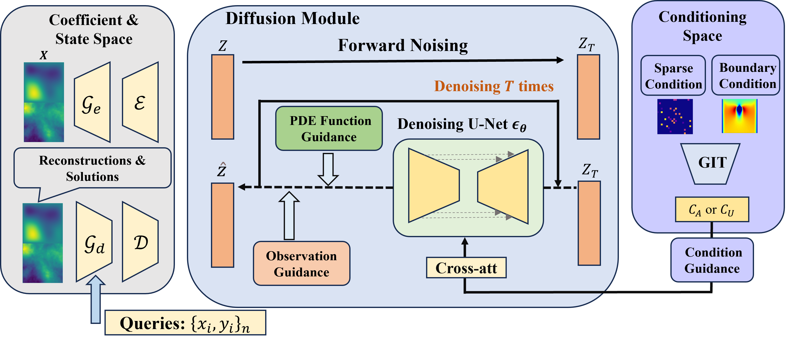

# Di-BiLPS

Di-BiLPS is a PDE-oriented diffusion project based on Hugging Face Diffusers and Transformers.



## Dataset

Dataset URL: [https://huggingface.co/Maxwell996996/Di-BiLPS-data/tree/main]
Checkpoint URL: [https://huggingface.co/Maxwell996996/Di-BiLPS/tree/master](https://huggingface.co/Maxwell996996/Di-BiLPS/tree/master)

Supported tasks:

- `darcy`
- `helmholtz`
- `ns-bounded`
- `ns-nonbounded`
- `poisson`

Recommended portable dataset layout (all relative paths):

- training data: `./<dataset>/detail/`
- validation data: `./<dataset>/detail/` (or another relative folder you choose)

Inference data is read from:

- `test_data/<dataset>/merge_0.npy`
- `test_data/<dataset>/mask.npy`

For full portability, avoid absolute paths in code.  
If needed, update the dataset path variables in:

- `train_img_encoder.py`
- `training/train_AE.py`
- `training/train_diffusion.py`

## Environment

```bash
conda env create -f env.yml
conda activate Di-BiLPS
```

Check the installed libraries:

```bash
python -c "import diffusers, transformers; print(diffusers.__version__); print(transformers.__version__)"
```

## Required Library Replacements

Two files in `replacements/` must replace files in the installed third-party libraries.

### 1. Replace the Diffusers pipeline

Project file:

- `replacements/pipeline_PDE_guided_sd.py`

Target location:

- `diffusers/pipelines/stable_diffusion/pipeline_PDE_guided_sd.py`

Run from the project root:

```bash
cp "$(python -c 'import diffusers, pathlib; p=pathlib.Path(diffusers.__file__).resolve().parent / "pipelines/stable_diffusion/pipeline_PDE_guided_sd.py"; print(p)')" \
   "$(python -c 'import diffusers, pathlib; p=pathlib.Path(diffusers.__file__).resolve().parent / "pipelines/stable_diffusion/pipeline_PDE_guided_sd.py.bak"; print(p)')" 2>/dev/null || true

cp replacements/pipeline_PDE_guided_sd.py \
   "$(python -c 'import diffusers, pathlib; p=pathlib.Path(diffusers.__file__).resolve().parent / "pipelines/stable_diffusion/pipeline_PDE_guided_sd.py"; print(p)')"
```

### 2. Replace the Transformers CLIP implementation

Project file:

- `replacements/modeling_clip.py`

Target location:

- `transformers/models/clip/modeling_clip.py`

Run from the project root:

```bash
cp "$(python -c 'import transformers, pathlib; p=pathlib.Path(transformers.__file__).resolve().parent / "models/clip/modeling_clip.py"; print(p)')" \
   "$(python -c 'import transformers, pathlib; p=pathlib.Path(transformers.__file__).resolve().parent / "models/clip/modeling_clip.py.bak"; print(p)')"

cp replacements/modeling_clip.py \
   "$(python -c 'import transformers, pathlib; p=pathlib.Path(transformers.__file__).resolve().parent / "models/clip/modeling_clip.py"; print(p)')"
```

Validate:

```bash
python -c "import diffusers.pipelines.stable_diffusion.pipeline_PDE_guided_sd as m; print(m.__file__)"
python -c "import transformers.models.clip.modeling_clip as m; print(m.__file__)"
```

## Project Layout

- `training/train_AE.py`: trains the custom VAE (`GINOAutoencoderKL`)
- `training/train_diffusion.py`: trains the diffusion UNet
- `train_img_encoder.py`: trains the CLIP-style condition encoder
- `inference_data.py`: runs PDE-guided inference
- `AutoencoderKL.py`, `GINO.py`, `clip_model.py`, `modules/`: project model code
- `data_gen/`: Hugging Face Datasets loaders
- `configs/`: per-dataset VAE, CLIP, and diffusion configs
- `train_scripts/`: launch scripts for each dataset
- `scripts/`: inference launch scripts
- `replacements/`: files that must be copied into Diffusers/Transformers

## Training

Run all scripts from the project root.

1. Train the condition encoder:

```bash
bash train_scripts/ns-nonbounded/condition_encoder_train_nt.sh
```

2. Train the VAE:

```bash
bash train_scripts/ns-nonbounded/ns-nonbounded_train_AE.sh
```

3. Train the diffusion model:

```bash
bash train_scripts/ns-nonbounded/ns-nonbounded_train_diff.sh
```

Equivalent scripts are available under `train_scripts/darcy/`, `train_scripts/helmholtz/`, `train_scripts/ns-bounded/`, and `train_scripts/poisson/`.

## Inference

Use the scripts in `scripts/`, or call `inference_data.py` directly:

```bash
python inference_data.py \
  --pretrained_model_name_or_path <unet_or_model_path> \
  --pretrained_vae_model_name_or_path <vae_path> \
  --pretrained_sheduler_model_name_or_path ./sampler \
  --pretrained_clip_model_name_or_path <clip_encoder_path> \
  --dataset_name ns-nonbounded \
  --inference_steps 200 \
  --use_irr_data
```

Common inference options:

- `--inverse`
- `--obs_guide_a_weight`
- `--obs_guide_u_weight`
- `--pde_guideweight`

Outputs are written to `vis_output/<dataset>/` and `test_data/<dataset>/`.

## Notes

- `configs/<dataset>/clip_vit_A.json` and `clip_vit_U.json` control the condition encoder.
- `use_cond=true` enables condition embeddings. This is used by `ns-bounded`.
- `use_cond=false` is used by `ns-nonbounded`.

## Acknowledgement

This project builds on [Diffusers](https://github.com/huggingface/diffusers) and [Transformers](https://github.com/huggingface/transformers).